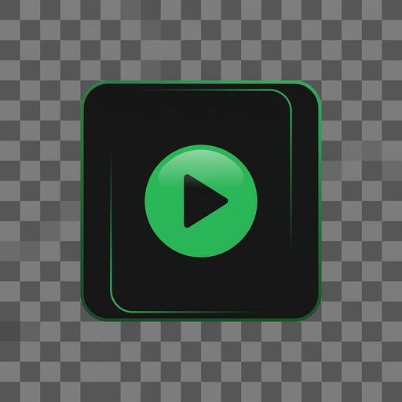
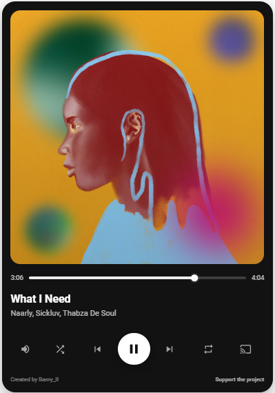

 
## Spotify Premium Card

A premium Spotify-inspired media player card for Home Assistant.

[](https://www.hacs.xyz/)
[](https://github.com/TU_USUARIO_GITHUB/spotify-premium-card/releases)
[](LICENSE)

Created and maintained by **Barny_II**.

> This project is independent and is not affiliated with, endorsed by, or sponsored by Spotify AB.



## Overview

Spotify Premium Card is a custom Lovelace card for Home Assistant with a Spotify-inspired design.

It displays album artwork, track metadata, playback progress, and playback controls in a compact premium-style layout. The card works with compatible `media_player` entities; Spotify is the main target of the first release.

## Features

### Version 0.1.0

- Spotify-inspired dark interface.
- Dynamic album artwork.
- Track title and artist.
- Playback progress bar with elapsed and total time.
- Local progress interpolation while media is playing.
- Play and pause.
- Previous and next track.
- Shuffle control with Spotify-green active state.
- Repeat control with Spotify-green active state.
- Single-row responsive control layout.
- Central circular play/pause button.
- Vertical volume control popover.
- Spotify-green volume track and white volume thumb.
- Automatic volume popover hide after 10 seconds.
- Volume fallback mute: second press on the volume icon sets volume to `0`; pressing it again restores the previous volume.
- Inline Material Design-inspired SVG icons without external icon dependencies.
- Responsive design for Home Assistant dashboards.

## Preview

The screenshot below shows the current interface and control layout.


## Requirements

- Home Assistant 2025.1.0 or newer.
- HACS is recommended for installation.
- A compatible `media_player` entity.
- Spotify Premium is required when using the official Spotify integration.

> **Important:** Available controls depend on the capabilities reported by the selected `media_player` integration and its active playback device.

## Installation

### HACS custom repository

Until the card is included in the default HACS repository list:

1. Open **HACS** in Home Assistant.
2. Go to **Frontend**.
3. Open the three-dot menu and select **Custom repositories**.
4. Add:

   ```text
   https://github.com/barnynv/spotify-premium-card
   ```

5. Select the category **Dashboard**.
6. Search for **Spotify Premium Card** and install it.
7. Reload the Home Assistant frontend when prompted.

### Manual installation

1. Download `spotify-premium-card.js` from the latest GitHub release.
2. Copy it into your Home Assistant configuration directory:

   ```text
   /config/www/spotify-premium-card.js
   ```

3. Add the resource in **Settings → Dashboards → Resources**:

   ```yaml
   url: /local/spotify-premium-card.js
   type: module
   ```

4. Reload the Home Assistant frontend.

## Configuration

Add a **Manual card** to your dashboard:

```yaml
type: custom:spotify-premium-card
entity: media_player.spotify
name: Spotify Premium
```

Replace `media_player.spotify` with your own media player entity.

### Example

```yaml
type: custom:spotify-premium-card
entity: media_player.spotify_casa
name: Spotify Premium
```

## Controls

| Control | Action |
|---|---|
| Volume | First press opens the vertical volume slider |
| Volume again | Mutes by setting volume to `0`; press again to restore volume |
| Shuffle | Enables or disables shuffle |
| Previous | Goes to the previous track |
| Play/Pause | Starts, pauses, or resumes supported playback |
| Next | Goes to the next track |
| Repeat | Enables or disables repeat |
| Cast | Reserved for a future device selector |

## Spotify limitations

The official Spotify integration in Home Assistant does not receive immediate push events from Spotify. Changes made in Spotify mobile, desktop, or web apps can take several seconds to appear in Home Assistant because the integration refreshes data by polling.

When Spotify has no active Spotify Connect playback device, the official integration may report the player as `idle` and not support `media_player.media_play`. In that case, start Spotify from a device or select an active Spotify Connect source first.

This is a limitation of the Spotify integration and Spotify Connect state, not of the card itself.

## Compatibility

The card is designed for `media_player` entities.

| Integration or device | Status | Notes |
|---|---|---|
| Spotify | Supported | Main target for v0.1.0 |
| Sonos | Experimental | Depends on supported media player features |
| Chromecast | Experimental | Depends on active cast session |
| Music Assistant | Experimental | Planned verification |
| Plex | Planned | Future release |
| Jellyfin | Planned | Future release |
| Kodi | Planned | Future release |

## Roadmap

### v0.1.0 — Initial public release

- [x] Spotify-inspired card interface
- [x] Dynamic artwork and metadata
- [x] Progress bar and local elapsed-time updates
- [x] Playback controls
- [x] Shuffle and repeat active states
- [x] Vertical volume slider and mute fallback
- [x] Responsive one-row control layout
- [x] HACS custom repository support
- [x] GitHub Actions validation and build artifact
- [x] Creator attribution and support link

### v0.2.0 — Reliability and configuration

- [ ] Card editor for visual configuration
- [ ] Configurable control visibility
- [ ] Configurable artwork size and card radius
- [ ] Configurable accent color
- [ ] Better unavailable, idle, and no-active-device states
- [ ] Optional volume and device controls
- [ ] Better progress synchronization and seek support where available
- [ ] Optional footer and author/support-link visibility

### v0.3.0 — Music experience

- [ ] Dynamic background color extracted from artwork
- [ ] Artwork transition animations
- [ ] Playback state animations
- [ ] Device selector / Spotify Connect source selector
- [ ] Queue view
- [ ] Favorite / like control where supported
- [ ] Lyrics integration where available

### v0.4.0 — Broader compatibility

- [ ] Full Music Assistant support
- [ ] Sonos-specific testing and improvements
- [ ] Chromecast-specific testing and improvements
- [ ] Plex support
- [ ] Jellyfin support
- [ ] Kodi support
- [ ] Adaptive visual themes by provider

### v1.0.0 — Stable release

- [ ] Full documentation and configuration reference
- [ ] Automated tests
- [ ] Accessibility review
- [ ] Translation support
- [ ] Stable HACS default repository submission
- [ ] Community-tested compatibility matrix

## Contributing

Contributions, bug reports, ideas, and testing feedback are welcome.

1. Open an [issue](https://github.com/barnynv/spotify-premium-card/issues) to report a bug or suggest a feature.
2. Fork the repository and create a dedicated branch.
3. Keep changes focused and test them in Home Assistant.
4. Open a pull request with a clear description and screenshots when the UI changes.

## Support the project

If this card is useful to you and you would like to support its development:

[Support the project on Revolut](https://revolut.me/ricardspw1)

## License

This project is released under the [MIT License](LICENSE).
